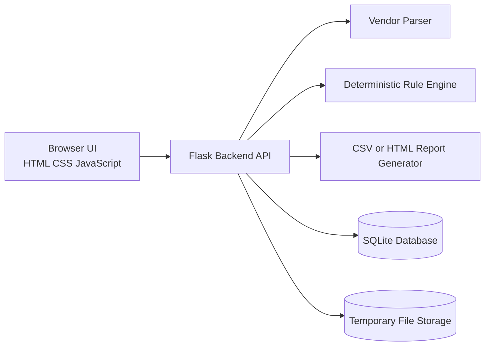
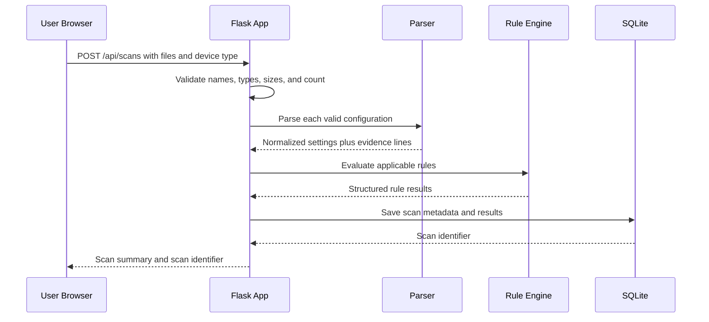
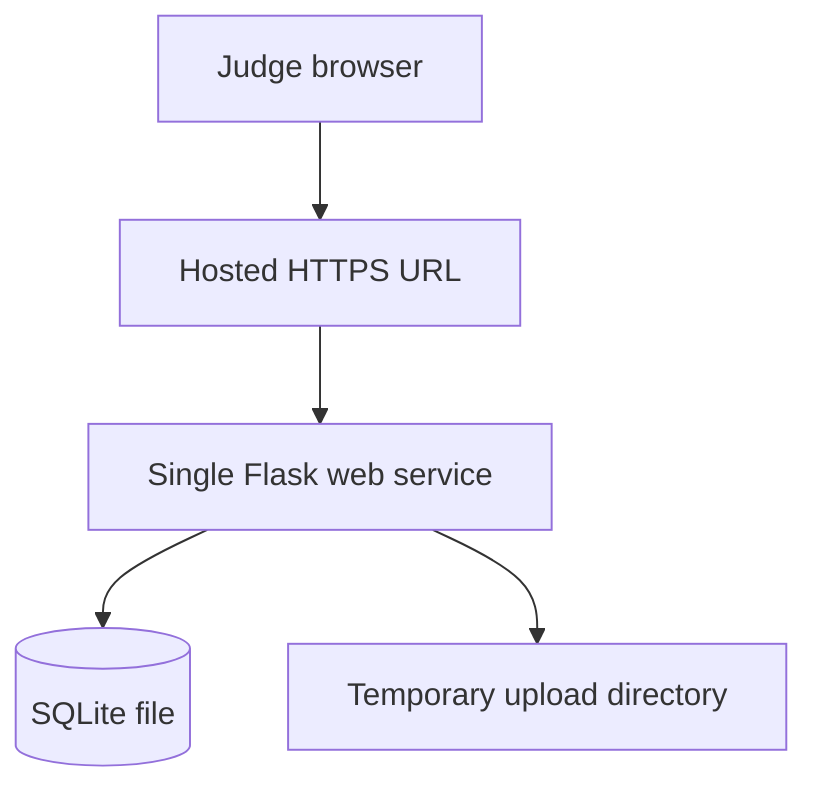

# Phoenix Protocol System Architecture

**Document status:** Hackathon MVP architecture  
**Audience:** Beginner developers using an AI coding agent  
**Product mode:** Read-only configuration assessment  
**Recommended deployment:** One small web application with one backend and one database

## Architecture summary

Phoenix Protocol should use a **simple three-layer web application**:



The browser handles user interaction. The Python backend handles file validation, parsing, compliance checks, and report generation. SQLite stores scan metadata and results. Uploaded configuration content should be temporary for the MVP and should not be retained longer than necessary.

This architecture is intentionally small. The team does not need microservices, Kubernetes, a message queue, a cloud data warehouse, or a live-device collection system for the hackathon.

## 1. Recommended tech stack

| Layer | Recommendation | Why it fits beginners |
|---|---|---|
| Frontend | Plain HTML, CSS, and JavaScript, optionally with Bootstrap | Avoids learning a large frontend framework before the scanner works |
| Backend | Python with Flask | Small, readable, and well suited to text processing |
| Parsing | Python functions and regular expressions | Enough for one controlled configuration format |
| Rule engine | Python functions with structured rule metadata | Easy to test and explain |
| Database | SQLite | No separate database server is required |
| Reports | Python CSV module and HTML templates | Simple exports with useful output |
| Testing | Pytest | Clear tests for parsers and rules |
| Version control | Git and GitHub | Enables teamwork and rollback |
| Deployment | One Docker container or a simple Python host | Keeps deployment understandable |

### Why not React for the first version?

React is a good choice for a larger interactive application, but it adds a build system, package management, component concepts, and a separate frontend development workflow. The Phoenix Protocol MVP has only a few screens. Plain HTML, CSS, and JavaScript can provide those screens faster.

If the team already knows React, React may be used with the same Flask API. It should not be introduced only because it is popular.

### Why not FastAPI?

FastAPI is also a good option, especially for typed APIs. Flask is slightly more straightforward for a beginner who needs to render pages and process forms in one application. Either choice is valid, but the team should choose one and avoid switching during the hackathon.

## 2. Frontend architecture

The frontend is the part running in the user’s browser. It should focus on four user tasks:

1. Upload files and select the device type.
2. Start a scan and see progress.
3. Review summary and detailed results.
4. Download a report.

### Recommended screens

| Screen | Purpose | Main elements |
|---|---|---|
| Home / Upload | Start a scan | Device-type selector, file picker, safety notice, scan button |
| Scan progress | Show that work is happening | Progress message, uploaded filenames, error notices |
| Dashboard | Understand the overall result | Device count, status counts, high-risk findings, compliance summary |
| Device details | Investigate one device | Rule table, filters, evidence, explanation, remediation |
| Rule details | Understand a rule | Rule title, requirement, severity, evaluation explanation |
| Report view | Prepare an export | Report summary and download button |

### Frontend behavior

The interface should use regular browser requests to call the backend. For example, submitting the upload form sends a `POST` request to `/api/scans`.

The frontend should not contain compliance logic. It should not decide whether Telnet is enabled or whether logging is compliant. The backend must be the single source of truth so that the same result is used by the dashboard and report.

### Beginner-friendly interface rules

- Use **Pass**, **Fail**, **Warning**, **Not applicable**, and **Error** as visible text.
- Do not communicate status only through colors.
- Show a short explanation near each technical term.
- Put high-severity failures at the top.
- Show a clear statement that the scan is read-only.
- Display an error beside the file that caused it instead of failing the entire scan.

## 3. Backend architecture

The backend is a Flask application organized into small modules. It should perform the following responsibilities:

### Upload and validation module

This module accepts uploaded files and checks:

- File extension and content type.
- Maximum file size.
- Filename safety.
- Number of files in one scan.
- Whether the file can be read as text.

It must never execute uploaded content. A configuration file is data, not a script.

### Parser module

The parser reads the selected vendor’s configuration and converts it into a normalized structure. For example:

```json
{
  "device_name": "edge-router-01",
  "vendor": "cisco-like",
  "secure_admin_enabled": true,
  "telnet_enabled": false,
  "logging_enabled": true,
  "time_sync_configured": false,
  "source_lines": {
    "secure_admin_enabled": [12, 13],
    "logging_enabled": [48]
  }
}
```

The parser should preserve source lines or snippets where possible. This allows the result to show evidence rather than only a boolean value.

### Rule engine

The rule engine receives normalized configuration data and evaluates rules. It should not know how the original vendor syntax looked.

A rule can be represented by metadata and a Python check function:

```python
{
    "rule_id": "NET-001",
    "title": "Telnet is disabled",
    "severity": "high",
    "check": check_telnet_disabled,
    "explanation": "Telnet does not provide modern secure administration.",
    "remediation": "Disable Telnet after confirming that an approved secure method is available."
}
```

The check function should return a structured result, not just `True` or `False`:

```python
{
    "status": "fail",
    "evidence": "line 42: transport input telnet",
    "message": "Telnet appears to be enabled.",
    "remediation": "Disable Telnet and use a secure administration method."
}
```

### Result and scoring module

This module aggregates individual rule results into device-level and scan-level summaries.

A simple compliance percentage can be calculated as:

```text
passing applicable rules / (passing + failing applicable rules) * 100
```

Warnings and errors should be shown separately rather than silently treating them as passes. The interface must label this as **tested-rule compliance**, not complete security.

### Report module

The report module converts stored results into CSV or HTML. It should use the same result objects shown in the web interface so that the report cannot accidentally disagree with the dashboard.

### Persistence module

The persistence module stores scan metadata and rule results in SQLite. It should not store raw configuration contents by default. If evidence snippets are stored, they should be limited to the lines needed for the report and used only with sanitized demo data.

## 4. Database choice

### Recommendation: SQLite

SQLite is a small relational database stored in a file. It is included with Python and does not require a separate server.

It is appropriate for the MVP because the demo has:

- A small number of users.
- A small number of scans.
- No need for distributed processing.
- No need for high availability.
- No need for real-time collaboration.

### Suggested tables

#### `scans`

| Column | Purpose |
|---|---|
| `id` | Unique scan identifier |
| `created_at` | Scan timestamp |
| `device_type` | Selected parser/device type |
| `status` | Overall scan status |
| `parser_version` | Version used to interpret files |
| `rule_set_version` | Version used to evaluate rules |

#### `devices`

| Column | Purpose |
|---|---|
| `id` | Unique device result identifier |
| `scan_id` | Related scan |
| `display_name` | Safe filename or extracted device name |
| `vendor` | Selected vendor |
| `parse_status` | Parsed, warning, or error |
| `error_message` | Optional parse error |

#### `rule_results`

| Column | Purpose |
|---|---|
| `id` | Unique result identifier |
| `device_id` | Related device |
| `rule_id` | Stable rule identifier |
| `status` | Pass, fail, warning, not applicable, or error |
| `severity` | High, medium, or low |
| `evidence` | Relevant source line or extracted value |
| `message` | Plain-language explanation |
| `remediation` | Suggested next step |

### What not to add yet

Do not add PostgreSQL, Redis, Elasticsearch, or a separate object-storage service unless the deployment platform requires one. These tools may be useful later, but they create setup and debugging work that does not improve the hackathon demo.

## 5. Authentication approach

### Recommendation: No authentication for the private hackathon MVP

The MVP should run locally or in a private demo environment using sanitized sample files. Authentication is not necessary if the application is not exposed to real users or real configuration data.

The interface should display a clear warning:

> This prototype is for sanitized or synthetic configurations. Do not upload production secrets.

### If authentication is required by the host

Use the hosting platform’s basic access protection or a simple single-user password stored as an environment variable. Do not build a full user-management system.

### Future approach

A production version would need user accounts, password hashing, session management, authorization, tenant isolation, audit logs, and secure file storage. Those requirements are intentionally outside this MVP.

## 6. External APIs and services

### Required external services: none

The MVP should not depend on an external API. The parser, rule engine, and report generator can run entirely inside the backend.

This makes the demo more reliable because it will not fail due to an expired token, rate limit, network outage, or unavailable third-party service.

### Optional services

| Service | Potential use | MVP decision |
|---|---|---|
| Cloud hosting | Make the demo accessible by URL | Optional |
| Object storage | Store uploads and reports | Not needed; use temporary local files |
| GitHub | Version control and collaboration | Recommended |
| Error tracking | Find runtime errors | Optional, only if already configured |
| SIEM or ticketing API | Send findings to operations tools | Out of scope |
| SSH or network-device API | Collect live configurations | Out of scope |

## 7. AI model integration, if required

### Recommendation: Do not use AI for compliance decisions

The pass/fail decision must come from deterministic rules. Given the same input, the system should produce the same output. An AI model may invent evidence or produce an inconsistent security judgment.

### Safe optional AI feature

If the team has time, AI can summarize results that the rule engine has already produced. For example, it can turn three known high-severity failures into a short management summary.

The AI should receive structured findings such as:

```json
{
  "device": "edge-router-02",
  "failed_rules": [
    {"rule_id": "NET-001", "severity": "high", "message": "Telnet appears enabled."},
    {"rule_id": "NET-005", "severity": "high", "message": "System logging was not detected."}
  ]
}
```

The AI should not receive or reproduce full secrets or entire raw configurations. The user interface should label the result as an optional summary, not authoritative compliance evidence.

### AI prompt safety

The prompt should instruct the model to:

- Summarize only the supplied findings.
- Never invent a rule result.
- Never claim that the device is fully secure.
- Avoid giving unverified production commands.
- State when information is missing.

If adding AI would delay the scanner, omit it from the demo.

## 8. Complete request and data flow

### A. Upload and scan flow



### Detailed step-by-step flow

1. The browser sends a multipart form request containing configuration files and the selected device type.
2. Flask checks file limits and rejects unsafe or unsupported input.
3. Flask assigns a scan identifier.
4. Each valid file is read as text. It is not executed.
5. The selected parser extracts normalized security settings and source evidence.
6. Parser problems are recorded as device warnings or errors.
7. The rule engine runs the relevant rules against the normalized settings.
8. Each rule returns a structured status, severity, evidence, explanation, and remediation.
9. The backend saves scan metadata and results in SQLite.
10. The backend returns a JSON summary to the browser.
11. The browser renders the dashboard.

### B. Dashboard flow

1. The browser requests `GET /api/scans/{scan_id}`.
2. Flask reads the scan and aggregated results from SQLite.
3. Flask returns counts, high-severity findings, and device summaries.
4. The browser displays cards, tables, and filters.

### C. Device detail flow

1. The user clicks a device.
2. The browser requests `GET /api/scans/{scan_id}/devices/{device_id}`.
3. Flask returns rule results for that device.
4. The browser displays evidence, explanations, and remediation guidance.

### D. Report flow

1. The user clicks **Download report**.
2. The browser requests `GET /api/scans/{scan_id}/report.csv` or `/report.html`.
3. Flask reads the same stored results.
4. The report generator creates the file.
5. Flask returns it as a download.

### Suggested API endpoints

| Method | Endpoint | Purpose |
|---|---|---|
| `POST` | `/api/scans` | Upload files and start a scan |
| `GET` | `/api/scans/{scan_id}` | Get scan summary |
| `GET` | `/api/scans/{scan_id}/devices` | List devices in a scan |
| `GET` | `/api/scans/{scan_id}/devices/{device_id}` | Get device rule results |
| `GET` | `/api/rules` | List visible rules |
| `GET` | `/api/rules/{rule_id}` | Get rule details |
| `GET` | `/api/scans/{scan_id}/report.csv` | Download CSV report |
| `GET` | `/api/scans/{scan_id}/report.html` | Download HTML report |
| `GET` | `/health` | Check application health |

For an even simpler Flask implementation, the team may render HTML templates directly instead of building a JSON API. The endpoint list above is useful if the frontend and backend are separated.

## 9. Folder structure

A simple Flask project can use this structure:

```text
phoenix_protocol/
├── app.py                  # Starts the Flask application
├── requirements.txt        # Python dependencies
├── README.md               # Setup and demo instructions
├── .env.example            # Names of optional environment variables
├── .gitignore
├── phoenix_protocol/
│   ├── __init__.py
│   ├── routes.py           # Web pages and API endpoints
│   ├── database.py         # SQLite connection and queries
│   ├── models.py           # Scan, device, and result data structures
│   ├── validators.py       # File type, name, and size checks
│   ├── parsers/
│   │   ├── __init__.py
│   │   └── cisco_like.py   # Parser for the selected first vendor
│   ├── rules/
│   │   ├── __init__.py
│   │   ├── definitions.py  # Rule metadata
│   │   └── checks.py       # Deterministic check functions
│   ├── services/
│   │   ├── scanner.py      # Coordinates parse and evaluation
│   │   └── reports.py      # CSV and HTML report generation
│   ├── templates/
│   │   ├── base.html
│   │   ├── upload.html
│   │   ├── dashboard.html
│   │   ├── device.html
│   │   └── rules.html
│   └── static/
│       ├── styles.css
│       └── app.js
├── sample_data/
│   ├── compliant_router.txt
│   ├── failing_router.txt
│   └── ambiguous_router.txt
└── tests/
    ├── test_parser.py
    ├── test_rules.py
    └── test_scan_flow.py
```

### Why this structure works

- `parsers` handles vendor syntax.
- `rules` handles compliance decisions.
- `services` coordinates workflows and reports.
- `routes.py` connects browser requests to application logic.
- `templates` and `static` contain the browser interface.
- `tests` protect the most important behavior.

The team should not create a separate folder for every theoretical future feature. Add structure only when the feature exists.

## 10. Major components

### Component 1: Upload page

**Input:** Device type and one or more files.  
**Output:** A scan request.  
**Important behavior:** Shows accepted file type, size limit, and read-only warning.

### Component 2: File validator

**Input:** Uploaded file metadata and content.  
**Output:** Valid file or a clear error.  
**Important behavior:** Rejects unsafe names, unsupported file types, oversized files, and unreadable content.

### Component 3: Vendor parser

**Input:** Configuration text.  
**Output:** Normalized settings plus source evidence.  
**Important behavior:** Produces warnings for ambiguous or missing settings.

### Component 4: Rule registry

**Input:** Rule definitions.  
**Output:** A list of applicable checks.  
**Important behavior:** Keeps rule identifiers stable and explanations visible.

### Component 5: Compliance engine

**Input:** Normalized configuration and applicable rules.  
**Output:** Structured results.  
**Important behavior:** Does not call an AI model for pass/fail decisions.

### Component 6: Result aggregator

**Input:** Individual rule results.  
**Output:** Device and scan summaries.  
**Important behavior:** Keeps warnings and errors visible.

### Component 7: Dashboard

**Input:** Scan summary.  
**Output:** Counts, filters, and prioritized findings.  
**Important behavior:** Gives users a fast understanding of the scan.

### Component 8: Evidence detail view

**Input:** Device and rule selection.  
**Output:** Source evidence, explanation, and remediation.  
**Important behavior:** Makes results auditable and understandable.

### Component 9: Report generator

**Input:** Stored scan results.  
**Output:** CSV or HTML file.  
**Important behavior:** Uses the same data as the dashboard.

## 11. Security considerations

### Uploaded-file safety

- Treat every upload as untrusted text.
- Never execute an uploaded file.
- Set a maximum file size.
- Limit the number of files per scan.
- Sanitize filenames before displaying or storing them.
- Store files in a temporary directory outside the public web folder.
- Delete temporary files after processing when practical.

### Secret protection

Network configurations may contain passwords, keys, tokens, or sensitive addresses. The demo must use sanitized data.

The system should avoid logging full file contents. If a secret-like pattern is detected, the evidence shown in the interface should be masked rather than displayed in full.

### Web security

- Use Flask’s normal template escaping.
- Do not insert raw configuration text into HTML without escaping it.
- Use a randomly generated scan identifier rather than trusting a user-supplied path.
- Add CSRF protection if using forms in a deployed environment.
- Use HTTPS when hosted publicly.
- Keep dependencies updated where practical.

### Report safety

Reports may contain sensitive evidence. For the MVP, reports should be generated on demand and downloaded rather than made permanently public. Do not place reports in a publicly guessable URL.

### Production limitations

The hackathon application is not ready for real production configurations unless it receives a full security review. This limitation should be stated in the README and demo.

## 12. Deployment architecture

### Simplest local deployment

```text
Developer laptop
└── Flask application
    ├── Web pages
    ├── Parser and rules
    ├── Temporary uploads
    └── SQLite database
```

Run the application locally with a Python virtual environment. This is the safest option for a first demo.

### Simple hosted deployment



A single service is sufficient. If the host supports persistent disk, the SQLite file can be stored there. If storage is temporary, the application should treat scans as demo-session data and explain that history may disappear after restart.

### Docker option

A minimal `Dockerfile` can install Python dependencies, copy the application, and start Flask with a production-capable WSGI server such as Gunicorn. Docker is useful if the team already understands it, but it should not become a separate learning project during the hackathon.

### Deployment checklist

- Bind the server to the host and port required by the platform.
- Set a non-debug mode for a public demo.
- Keep secrets in environment variables, not source code.
- Test a scan after deployment.
- Verify report downloads.
- Use only sanitized sample files.
- Display a prototype-use warning.

## 13. Simplifications for a hackathon

The following decisions make the project achievable:

1. **Support one vendor format.** A reliable parser is more valuable than several incomplete parsers.
2. **Use manual device-type selection.** Automatic detection can wait.
3. **Use 8–10 rules.** Choose rules that are easy to demonstrate and explain.
4. **Use fixed rule metadata.** Avoid building a custom rule-authoring interface.
5. **Use SQLite.** Avoid managing a separate database server.
6. **Use temporary file processing.** Avoid building cloud storage and retention policies.
7. **Skip authentication.** Keep the demo private and use sanitized files.
8. **Skip live-device connections.** Avoid credentials, network failures, and production risk.
9. **Use CSV first.** Add HTML export only if the core result is stable.
10. **Use fixed explanations.** Do not depend on AI for the main workflow.
11. **Use a simple table before charts.** Add charts only after result accuracy is demonstrated.
12. **Keep scanning synchronous.** For three to five small files, a background job is unnecessary.
13. **Use a local demo dataset.** Judges should be able to see pass, fail, and warning results immediately.
14. **Test the parser and rules before polishing the interface.** Incorrect results damage the product’s credibility.

## Suggested implementation order

| Order | Task | Definition of done |
|---:|---|---|
| 1 | Create Flask app and upload page | A file can be selected and received |
| 2 | Add validation | Unsafe or unsupported files are rejected |
| 3 | Create three sample configurations | Compliant, failing, and ambiguous cases exist |
| 4 | Build parser | Sample settings and evidence lines are extracted |
| 5 | Implement eight to ten rules | Tests cover pass, fail, and warning cases |
| 6 | Save results in memory or SQLite | Scan results can be retrieved |
| 7 | Build dashboard | Counts and high-risk findings are visible |
| 8 | Build device detail view | Evidence and remediation are visible |
| 9 | Add CSV export | Report downloads successfully |
| 10 | Rehearse demo | Upload-to-report flow works without manual code changes |

## Final recommendation

Build Phoenix Protocol as one small Flask application with plain browser pages, a single parser, a deterministic rule engine, and SQLite. Keep the application read-only and use sanitized files. Put effort into correct rule results, visible evidence, clear explanations, and a smooth demo rather than adding live-device access, authentication, AI decisions, or many vendors.

> The architecture is successful if a beginner can explain the complete path: **upload file → parse settings → run rules → show evidence → export report**.

## References

[1]: https://flask.palletsprojects.com/ "Flask Documentation"

[2]: https://docs.python.org/3/library/sqlite3.html "Python sqlite3 Documentation"

[3]: https://docs.pytest.org/ "pytest Documentation"

[4]: https://owasp.org/www-project-top-ten/ "OWASP Top 10 Web Application Security Risks"

[5]: https://www.nist.gov/cyberframework "NIST Cybersecurity Framework"

